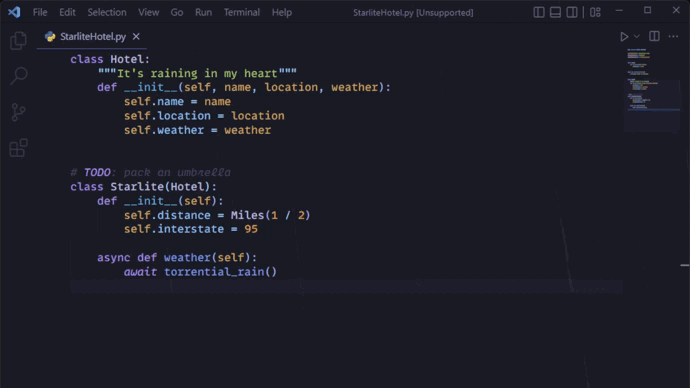

# RAINING IN V S C O D E

Inspired by [RAINING IN M I A M I](https://www.youtube.com/watch?v=1N8zRJpfnMM&t=49s), I bring you:

For all of your soothing rain lofi vibes while coding.

## Installation

This extension is based heavily on the method of custom CSS/JS demonstrated by [Synthwave '84](https://github.com/robb0wen/synthwave-vscode). The instructions are largely the same.

[Install this extension from the VS Marketplace](https://marketplace.visualstudio.com/items?itemName=TorShepherd.raining-in).

From the command palette, run `Enable Downpour` and select `restart` to start the rain. To disable, run `Disable Downpour`.

## Customization

Raining In offers several settings to customize the appearance of the rain:

- `rainingin.raindrop.minFallHeight` and `maxFallHeight`: Raindrops end up somewhere in between these values. I recommend setting maxFallHeight to the height of your editor/monitor, and min around 200 pixels less than that.
- `rainingin.window.width`: Set this to the maximum width you foresee using your editor at. If it's less, you won't get rain across the whole thing. If greater, might waste raindrops outside of the viewport.
- `rainingin.autoreload`: Set this to true to automatically reload on enable/disable.
- `rainingin.foregroundOpacity`: Rain works by making the foreground slightly transparent. I recommend setting this to the highest possible value between 0 and 1 that you can see the rain (to not wash out your editor too much)
- `rainingin.raindrop.color`: Simple. The tint of the rain as a hex value.
- `rainingin.raindrop.minOpacity` and `maxOpacity`: Raindrops will have a random opacity between these values. Max should probably be 1, but making min smaller will have more variation in opacity.
- `rainingin.raindrop.count`: How many raindrops. This will probably have the greatest performance hit, so on a less powerful machine try reducing this if you're not hitting your desired fps or seeing any kind of slowdown in your editor.
- `rainingin.raindrop.minSpeed` and `maxSpeed`: How fast the rain falls, pixels per second.
- `rainingin.raindrop.minDelay` and `maxDelay`: The randomness effect is achieved by staggering when the rain starts. If both are set to the same value, rain will start pretty much synchronized, so having a good margin here is key to organic look. Increasing both delays overall will have the effect of more of a drizzle.
- `rainingin.raindrop.minAngle` and `maxAngle`: The rain chooses a random angle between these values. Positive is rain falling to the right. Might look weird if min is negative and max is positive.
- `rainingin.raindrop.minSize` and `maxSize`: The raindrops choose a width in pixels between these values. Might look weird if too thick.
- `rainingin.raindrop.minLength` and `maxLength`: Raindrops choose a lenght between these values. Gives the rain a motion blur effect essentially. Longer drops work well in combination with faster speeds.

## Contributing

Feel free to add issues/PRs for any small bugfixes or bigger additions to the extension you'd want to see. Check out [TODO.md](TODO.md) for stuff I want to add eventually.
